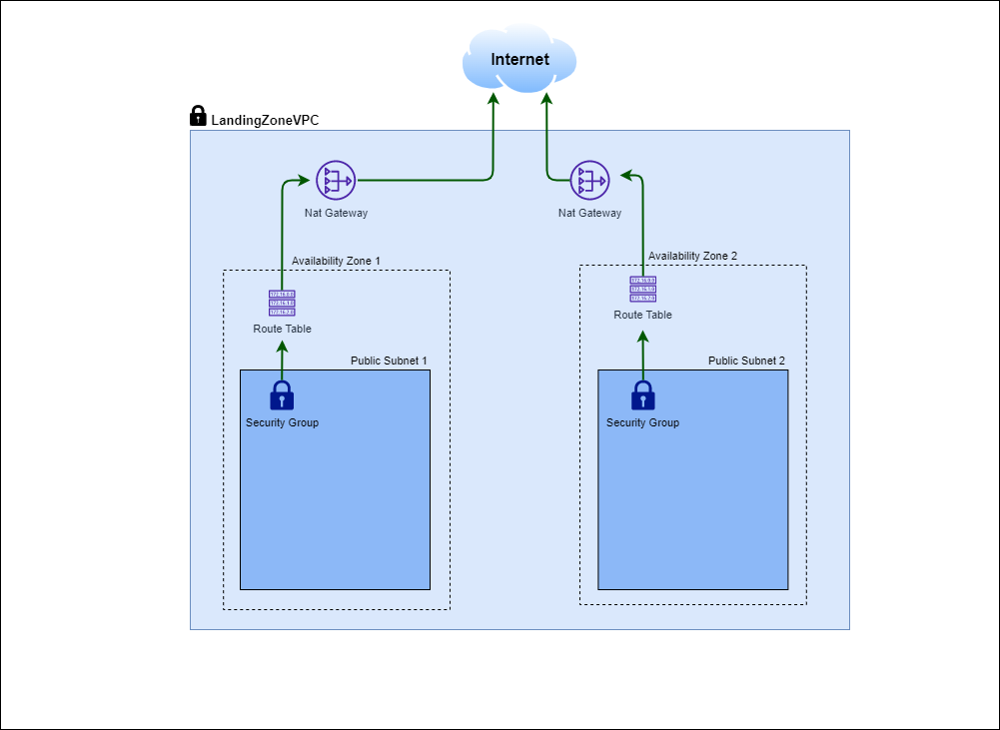

# Landing Zone Example on Tencent Cloud
This Terraform creates the basic landing zone on Tencent Cloud.

## Prerequisites
You must have the following ready

- Secret ID
- Secret Key 
- Terraform
- Tencent Cloud Account

To create Secret ID and Secret Key, please refer to https://www.tencentcloud.com/document/product/598/32675?lang=en 

For Terraform setup, please refer to https://developer.hashicorp.com/terraform/downloads 

## Architecture we are creating


## Components 
 - VPC
 - Subnets
 - Network ACLs (not included yet in the code)
 - Security Groups
 - Route tables
 - NAT Gateway
 - EIP
 - Tags for TC resources

## How to run
```
terraform init
terraform plan
terraform apply
```
